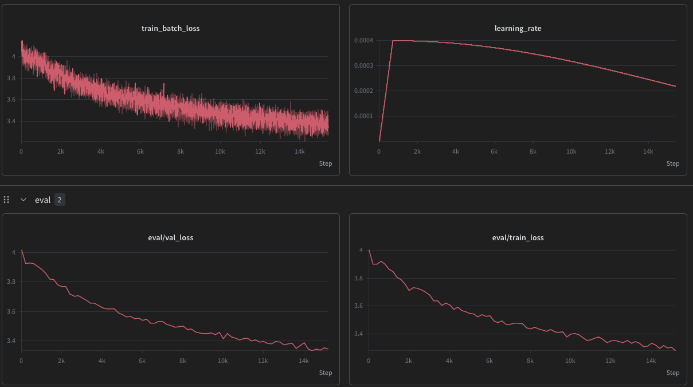
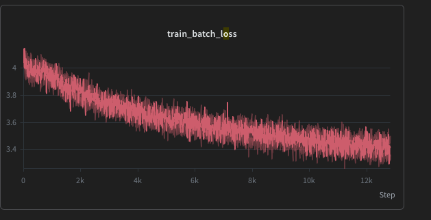

# MiniGPT — a modern small language model, built from scratch

A decoder-only transformer implemented **from scratch in PyTorch** — from a ~14M toy up to an **~88M base model** — using the same architectural building blocks as modern LLMs like Llama, Mistral and Qwen.

Trained across three datasets:
- **French Dostoïevski** (~14M) — a stylistic pastiche generator, and a live demonstration of *overfitting*.
- **TinyStories** (~16M) — coherent little English stories: what a tiny model *can* do when the data matches its capacity.
- **FineWeb-Edu** (~88M) — scaling up to a real GPT-2-class base model on diverse educational web text.

Training runs on cloud GPUs (RunPod), inference runs locally on Apple Silicon (MPS) — the first step toward my personal goal to master on-device deployment.

> This is a **learning-in-public** project. The goal was to master the fundamentals by building them, not to reach state-of-the-art.

---

## Architecture (`model.py`)

Every component below is implemented by hand. These are the same choices found in Llama-2/3, Mistral and Qwen.

| Concept | What it is | Why it's here |
|---|---|---|
| **Grouped-Query Attention (GQA)** | Many query heads share fewer key/value heads (e.g. 12 Q for 4 KV) | Shrinks the KV-cache and memory bandwidth vs. full multi-head attention, with almost no quality loss — critical for efficient inference |
| **Rotary Position Embeddings (RoPE)** | Positions encoded by *rotating* the query/key vectors | No learned positional table, encodes **relative** position, and composes cleanly with the KV-cache |
| **QK-norm** | RMSNorm applied to queries & keys before attention | A recent trick (Qwen3, Gemma2) that stabilizes training, especially at larger scale |
| **KV-cache** | Caches keys/values across generation steps | Each new token only computes its **own** attention instead of recomputing the whole sequence → turns O(n²) decoding into O(n). This is what makes on-device generation fast |
| **SwiGLU feed-forward** | Gated MLP with a SiLU activation (hidden dim rounded to a multiple of 8) | Outperforms a plain ReLU/GELU MLP at the same parameter budget |
| **RMSNorm** | LayerNorm without mean-subtraction or bias | Cheaper and just as stable; the Llama-family norm |
| **Pre-norm residuals** | Normalize *before* attention/FFN | Stabler gradients in deep stacks |
| **Weight tying** | Token embedding shares weights with the output head | Fewer parameters, better generalization |

**Fully parameterized config** — the same code runs the ~14M toy (`embed_dim=384, num_layers=8, block_size=256`) and the ~88M base model (`embed_dim=768, num_layers=12, block_size=512`).

---

## Training (`train.py`)

| Feature | Detail |
|---|---|
| **Cosine LR schedule + linear warmup** | Learning rate ramps up ("warm-up the motor"), then decays via cosine to a floor — the standard modern recipe |
| **Gradient clipping** | Global norm clipped to 1.0 to prevent exploding gradients |
| **bf16 mixed precision** | ~2× faster / half the memory on Ampere+ GPUs; auto-detected and disabled on unsupported hardware |
| **`torch.compile`** | Kernel fusion for extra speed on capable GPUs |
| **Early stopping + best-checkpoint** | Saves the checkpoint at the **minimum** validation loss, and stops when validation stops improving (patience-based) |
| **Token cache** | Tokenizes the corpus once and stores the ids as a compact `.npy` — later runs reload in seconds instead of re-tokenizing (~1.9 GB corpus went from ~15 min to seconds) |
| **Automatic device selection** | CUDA → MPS (Apple Silicon) → CPU |
| **Experiment tracking** | Weights & Biases (loss curves, learning rate, eval metrics) |
| **AdamW** optimizer, dropout `0.2` | |

Checkpoints store the model weights **and** their config, so inference reconstructs the exact architecture with no hard-coded hyperparameters. Generation (`generate.py`) is autoregressive with the KV-cache and supports **temperature, top-k and top-p (nucleus)** sampling.

---

## Results

### Dostoïevski — a lesson in overfitting
A ~14M model on only **~2.4M tokens**. With so much capacity relative to the data, the model **overfits**: validation loss bottoms out around **3.38** (step ~2000) and then *rises* as the model starts memorizing.

> *"Raskolnikov le regarda avec colère. — Oui, oui, j'ai voulu le tuer ! Je le connais ! cria-t-il, s'étant levé soudain… Raskolnikov prit sa casquette, s'assit sur le divan, tira le revolver."*

Grammatical, stylistically convincing French with real Dostoïevski characters (Raskolnikov, Sonia, the Prince, Lébédev) — but the *meaning* drifts. Exactly what a 14M model produces on a task that's too hard for its size: **style without semantics**.

### TinyStories — matching data to capacity
A ~15.7M model on **~89M tokens** (35× more data). Now train and validation loss descend **together** with **no overfitting**, reaching a validation loss of **~1.67**. The model produces genuinely **coherent** short stories.

> **Prompt:** *The plane* &nbsp;·&nbsp; temperature 0.6 / top-k 20
>
> *The plane landed on the floor with a thud. The plane broke into pieces... Lily and Ben stopped fighting. They looked at the broken plane. They felt very sorry. "I'm sorry, Lily. I was greedy. I should have let you drive the plane," Ben said... They hugged and said they were sorry. They decided to share the plane and play together. They learned to share and to be kind to each other. They were happy and friends again.*
>
> A complete little story — arc, dialogue, and even a moral — from a ~15.7M-parameter model. Same architecture as the Dostoïevski sample above; the difference is **data matched to model capacity**.

### FineWeb-Edu — scaling up to a real base model
An **~88M** model on **~470M tokens** of diverse educational web text (FineWeb-Edu), trained on an A40 with bf16 + `torch.compile` + **QK-norm** for stability. Validation loss descends steadily to a best of **3.33** with train and val tracking closely — a genuine (if undertrained) GPT-2-class base model.




*Loss over the FineWeb-Edu run — resumed from a checkpoint after a mid-run disconnect, so the curves start around ~4.0 (the full run went from ~9.7 to a best validation loss of **3.33**). Train and validation track closely: no overfitting even past one epoch.*

**Takeaway:** the same hand-built architecture scales from a 14M toy to an 88M base model. The main lever for a small model is **data**, not architecture — Dostoïevski *looks* impressive but overfits, TinyStories is coherent, and FineWeb-Edu shows the pretraining recipe holding as the model grows.

---

## Project structure

```
model.py                 # The transformer: GQA, RoPE, QK-norm, RMSNorm, SwiGLU, KV-cache
train.py                 # Training loop: LR schedule, bf16, token cache, early stopping, wandb
dataset.py               # Random-window batch sampler
tokenizer.py             # ByteLevel BPE tokenizer wrapper
train_tokenizer.py       # Trains the BPE tokenizer on a corpus
generate.py              # Interactive CLI generation (KV-cache, top-k / top-p sampling)
clean_corpus.py          # Cleans/assembles raw text (hyphenation, wrapping, BOM, Gutenberg headers)
prepare_tinystories.py   # Streams a TinyStories subset into a training corpus
prepare_fineweb.py       # Streams a FineWeb-Edu subset into a training corpus
```

---

## How to run

```bash
# 1. Setup
python -m venv .venv && source .venv/bin/activate
pip install torch tokenizers wandb datasets numpy

# 2. Prepare a corpus
python prepare_fineweb.py          # FineWeb-Edu  (or prepare_tinystories.py / clean_corpus.py)

# 3. Train the tokenizer on it
python train_tokenizer.py

# 4. Train the model  (auto-detects CUDA / MPS / CPU)
python train.py

# 5. Generate text interactively
python generate.py
```

---

## What I learned

- How a Transformer actually works — going from "what's an attention head?" to implementing GQA, RoPE, QK-norm and a KV-cache by hand.
- Building the modern transformer stack (GQA, RoPE, SwiGLU, KV-cache) instead of importing it.
- **Reading loss curves**: watching overfitting happen live (train ↓ while val ↑) and fixing it with early stopping + more data.
- The KV-cache as the key to fast, on-device inference.
- The real bottleneck for a small model is **data**, not compute or VRAM.
- Scaling the *same* architecture from a 14M toy to an **88M base model** on real web data (FineWeb-Edu) — and why bigger models need more data and stabilizers like QK-norm.
- The full ML loop end-to-end: data cleaning → tokenizer → cloud GPU training (bf16, `torch.compile`) → checkpoint export → local inference.